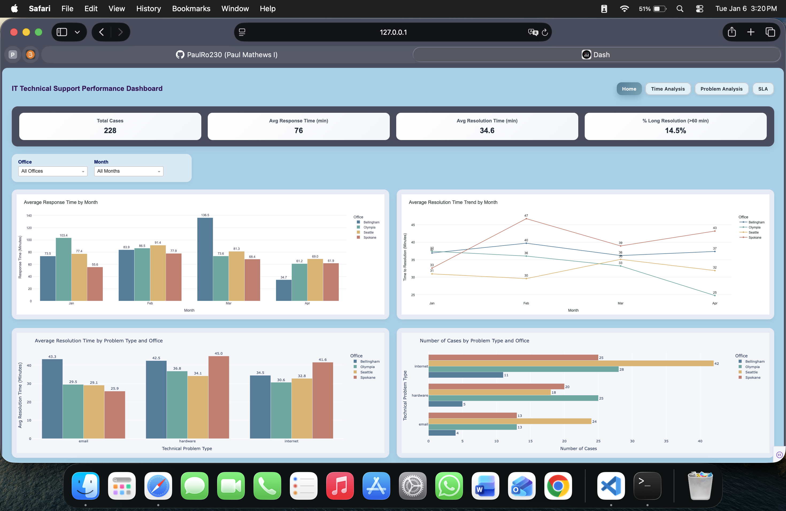
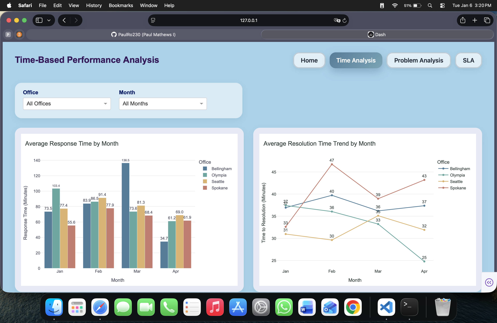
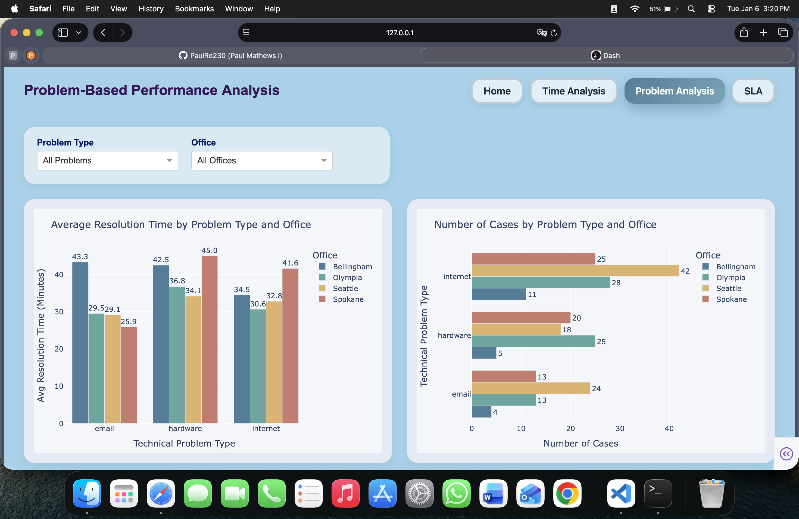
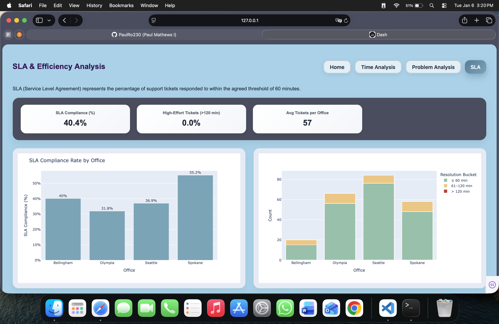

# IT Technical Support Performance Dashboard (Dash + Plotly)

An interactive dashboard built in **Python** using **Dash** and **Plotly** to analyze IT technical support performance across offices, time periods, and technical problem categories.

This project visualizes operational ticket data (from `Bogdan.xlsx`) and provides KPI summaries, interactive filtering, and SLA compliance insights.

---

## Key Features

- **Time-based analysis:** response time and resolution time trends across months and offices  
- **Problem-based analysis:** workload and resolution impact by technical problem type and office  
- **SLA & efficiency page:** additional KPIs and charts focused on compliance and workload severity  
- **Interactive filters:** user-driven analysis through dropdown filters  
- **Clean modular structure:** separate `layouts`, `callbacks`, and `charts` folders

---

## Screenshots

### Home Page


### Time Analysis


### Problem Analysis


### SLA & Efficiency


---

## Tech Stack

- Python
- Dash
- Plotly
- Pandas
- OpenPyXL (Excel reading)

---

## ▶️ How to Run Locally

1. Install dependencies:
    ```bash
    pip install -r requirements.txt

2.	Run the app: 
    python app.py

3. Open in your browser: 
    http://127.0.0.1:8050

---

## Project Structure
app.py                  # Main Dash app
codes/                  # Callbacks, layouts, charts, data loader
assets/                 # CSS styling
data/                   # Dataset (Bogdan.xlsx)
screenshots/            # Dashboard screenshots for documentation

---

## Author
**Paul Mathews Irigi**
Purdue University Northwest
ITS 46600 – Data Visualization Technology